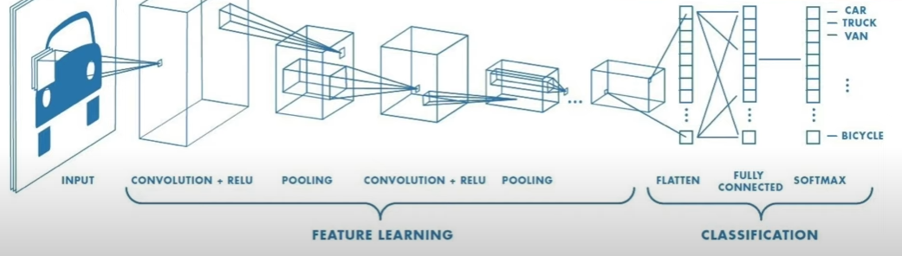
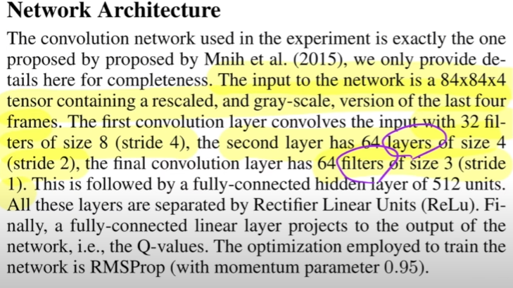

# Convolutional Neural network 탄생 배경
- 훈련된 데이터와 조금 벗어나도 인지를 못한다 ..?, 너무 자세하게/복잡하게 구현 (연산 많음) : overfitting의 문제점
    - 이를 융통성 있게 하기 위해 탄생

## Convolution ?
#### 신경 다발을 최적화하여 효율적으로 하기 위함! 위치별 패턴을 찾아 결론을 도출!

- 구현 알고리즘
    - x(==img), h(==필터)
    - 상대적으로 작은 사이즈의 h를 x와 비교하며 진행
    - 파리채 문제와 비슷함 (2D의 기준)
    - 이와 같은 과정을 거치면, 갑자기 이미지가 달라지는 경우, 값이 급증한다. 이를 활용해 윤곽을 파악할 수 있다. (소베 필터 예시)
        - 윤곽을 파악한다면, 그냥 사진을 활용하면 발생할 수 있는 overfit 문제를 해결하여 효율적인 img 판단이 가능하다.
        - 필터를 계속 씌우고 하다보면 size 가 계속 줄테고, 결국 눈이 어떻고 코가 어떻고 .. 결과 도출

- Stride
    - 한 픽셀 한 픽셀 탐색할 필요 있을까?
        - 귀를 본다고 치면, 적절하게 듬성 듬성 봐도 충분히 파악 가능하잖아. 그 개념
    
- Max-pooling
    - 쉽게 말해, 샘플링을 하며 이미지 사이즈를 줄여가는 과정 (줄이면, 연산 과정 줄어듬)

### 위 논문의 내용
1. 84 x 84 x 4
- 84 84 사이즈, 4장 (찰나의 영상)을 input data로 활용했다.
2. The first convolution layer convolves the input with 32 filters of size 8 (stride4), the second layer has 64 layers of size 4(stride2), the final convolution layer has 64 filters of size 3(stride1)
- 84 84 4(input) => 8 8 4(filter, 32개) => 4 4 32(filter, 64개) => 3 3 64(filter, 64개) => 512(unit)

