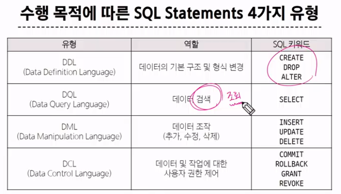

#  Relational DB
## 개요
- DB : 데이터를 저장하고 구조화
- 관계형 DB : 데이터 간의 관계가 있는 데이터 항목들의 모음
    - 테이블, 행, 열 정보를 구조화 하는 방식
    - 서로 관련된 데이터 포인터를 저장하고 이에 대한 액세스 제공
    - 논리적 연결로 다양한 형식의 조회방식 활용 가능
    - 외래키를 활용해 관계 형성 (join)
## DBMS
- 데이터 저장 및 관리 목적 (용이하게)
## RDBMS
- 관계형 DB 관리 소프트웨어
## Structure Query Language(SQL)
- 테이블의 형태로 구조화된 관계형 DB에 요청을 질의
- DB에 정보를 저장하고 처리하기 위한 프로그래밍 언어

## SQL 문법
1. 대소문자를 구별하지 않는다. (대문자 권장)
2. SQL statements의 끝에는 ';' 이 필요

### Statement
```sql
SELECT column_name FROM table_name;
```
- 이 SQL 문법은 SELECT, FROM의 Statement로 구성됨.


## SELECT syntax
```sql
SELECT
    select_list
FROM
    table_name;
```
- 어떤 것을 어디서 가져오겠다 순서로 작성됨.

------------
# 오후 수업
```sql
CREATE TABLE examples (
    ExamId INTEGER PRIMARY KEY AUTOINCREMENT,
    LastName VARCHAR(50) NOT NULL,
    FirstName VARCHAR(50) NOT NULL,
);

PRAGMA table_info('examples');
```

## SQLite 데이터 타입
1. NULL
2. TEXT
3. INTEGER
4. REAL (부동소수점)
5. BLOB (이미지, 동영상, 문서등의 바이너리 데이터)

## Constraints (제약조건)
- 테이블의 필드에 적용되는 규칙 또는 제한사항
    - 데이터의 무결성을 유지하고 데이터베이스의 일관성을 보장

### PRIMARY KEY
- 해당 필드를 기본 키로 지정
- INTEGER 타입에만 적용되며, INT, BIGIINT 등 다른 정수 유형은 적용 X

### NOT NULL
- 해당 필드에 NULL 값을 허용하지 않도록 지정

### FOREIGN KEY
- 다른 테이블과의 외래 키 관계를 정의

## AUTOINCREMENT
- 자동으로 고유한 정수 값을 생성하고 할당하는 필드 속성
    - 필드의 자동 증가를 나타내는 특수한 키워드
- 주로 PRIMARY KEY 필드에 적용
- 삭제된 값은 무시되며 재사용 할 수 없음.

---------
# 외래키 (Foreign key)
- 의존성을 생성한다.
- == 제약조건 
    - 참조하는 테이블에 미리 생성된 행을 반드시 참조해야 하고
    - 참조하는 외래키 값이 반드시 존재해야하는 제약이 따른다.

- users table
```sql
CREATE TABLE Users (
    id INTEGER PRIMARY KEY AUTOINCREMENT,
    name VARCHAR(30) NOT NULL,
);
```
- 주문 테이블
```sql
CREATE TABLE Orders (
    OrderId INTEGER PRIMARY KEY AUTOINCREMENT,
    OrderDate DATE NOT NULL,
    UserId INTEGER,
    FOREIGN KEY (UserId) REFERENCES Users(id)
);
```

# Join
- INNER JOIN , LEFT JOIN ...
- 두 테이블에서 값이 일치하는 레코드에 대해서만 결과 반환

