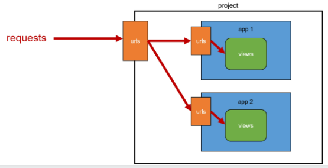
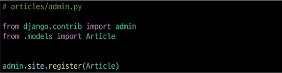

# Dispatcher
## App URL mapping
- 굳이 프로젝트 하나에 url 하나만을 사용해야 할까?
- 각 앱에 URL을 나누고 정의하는 것

- 프로젝트의 urls.py에 include를 추가로 import하고, 앱 별 url경로를 할당해준다.
```python
from django.urls import path, include
# include!

urlpatterns = [
    path('articles/',include('articles.urls'))
    ...
]
# 해당 앱의 url로 연결
```

하지만 url구조를 변경하는 것이 문제를 완벽하게 해결하는 것은 아니다. - 이름을 지어준다면?
## Naming URL patterns
- urls.py 설정 시 path 맨 뒤에 name = '~~'으로 이름을 지정한다.
- form의 action처럼 url을 작성하는 양식을 바꾼다.
```html
<!-- example -->
<!-- 기존 -->
<a href = "/dinner/">dinner</a>

<!-- 변경 후 -->
<a href = "">dinner</a>
```

하지만 url의 이름이 같은 경우가 발생할 수 있다. 즉, 단순히 이름으로만 완벽하게 분리할 수 없다는 것. - 만약 key를 붙힌다면?
## URL 이름 공간
- 앱별로 할당된 urls.py에 app_name이라는 변수를 추가로 할당한다.
- 이후 를  꼴로 변경한다.


# Model 클래스 - DB관리
- class를 활용한다.
    - class 내 models.CharField(), models.TextField() ... 등을 활용한다.
- models.py파일에는 from django.db.models import Model 이 정의되어있는데, 여기서 models를 활용해 다음과 같이 class를 정의한다.
```python
class Article(models.Model):
    title = models.CharField(max_length=10)
```
- 모델필드(CharField() ... )는 찾아보고 활용하기

# Migrations
- model 클래스의 변경사항을 DB에 최종 반영 목적
- model 클래스를 최종 반영하는 과정은 다음과 같다.
    1. model class를 정의한다.
    2. python manage.py makemigrations
    - model class를 기반으로 최종설계도 작성
    3. python manage.py migrate
    - 최종설계도를 DB에 전달하여 반영

# admin 계정 설정(관리자)
```python
python manage.py createsuperuser
```
- 위 과정 이후 admin.py에 작성한 모델 클래스를 등록해야만 admin site에서 확인이 가능하다.

