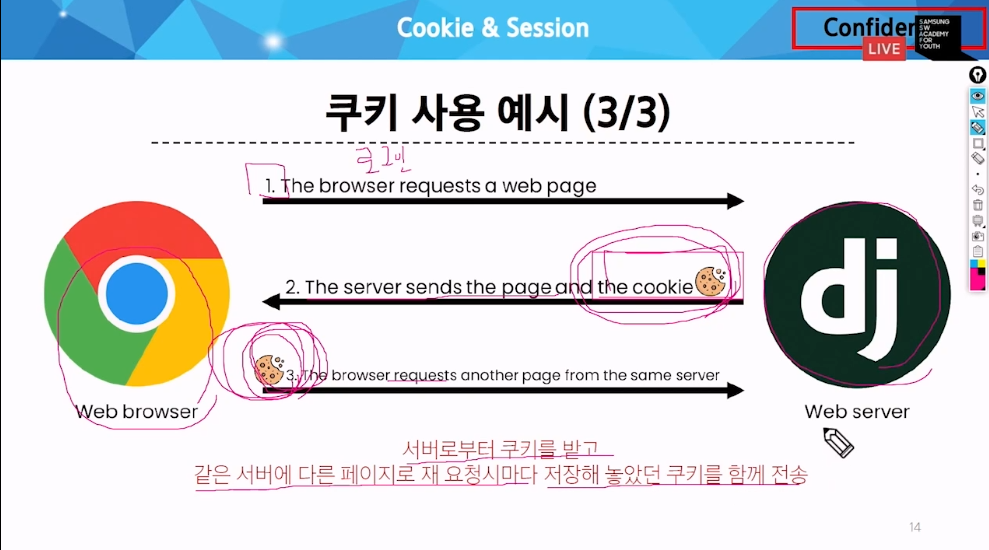

# Authentication SYS
## Cookie & Session
### HTTP의 특징
1. 비연결 지향
- 서버는 요청에 대한 응답을 보낸 후 연결을 끊음
2. 무상태
- 연결을 끊는 순간 클라이언트와 서버 간 통신이 끝나며, 상태 정보가 유지되지 않음.
    - 이를 유지하기 위해 쿠키 필요!
### 쿠키
- 서버가 사용자의 웹 브라우저에 전송하는 작은 데이터 조각
- 사용자 인증, 추적, 상태유지 등에 사용되는 데이터 저장 방식


- 세션관리 (로그인, 아이디 자동완성, 공지 하루 안보기, 팝업 체크, 장바구니), 개인화(사용자 선호, 테마 등 설정), 트래킹(사용자 행동 기록 및 분석)에 활용

### Session(세션)
- 서버측에서 생성되어 클라이언트와 서버 간 상태 유지, 상태 정보를 저장하는 데이터 방식
    - 쿠키에 세션 데이터를 저장하여 매 요청시마다 세션 데이터를 함께 저장 (쿠키 안에 세션 데이터)
- 로그인 성공시 session 데이터 생성 후 session id 발급, 이후 이를 확인하며 로그인 유지

## Authentication (인증)
### 사전준비
- `accounts` 이름의 앱 생성 및 등록 (앱 이름 무관하긴 하나, 내부적으로 accounts라는 이름으로 사용하기에 권장)
    - 생성, settings.py에 등록, url경로 지정 ...

### Custom User model
- django에서 기본적인 user model을 제공하지만(auth 앱에 작성된 user class), 이는 개발자가 직접 수정하는 것이 불가하기에 custom이 권장된다.
    - custom을 하면 db를 초기화 해야하므로 초반에 진행!

#### Custom User model - 과정
- 암기할 필요는 없다.
1. models.py 수정
    ```python,django
    from django.contrib.auth.model import AbstractUser
    
    class User(AbstractUser):
        class Meta()
        
        pass
    ```

2. settings.py 수정
    ```python,django
    AUTH_USER_MODEL = 'accounts.User'
    # 추가
    ```

3. admin.py 수정
    ```python,django
    from django.contrib.auth.admin import UserAdmin
    from .models import User

    admin.site.register(User, UserAdmin)
    # 이 내용 추가되어야 함.
    ```

### Login
- Session을 create하는 과정
#### AuthenticationForm()
- 로그인 인증에 사용할 데이터를 입력 받는 built-in form
- 인증에 사용할 목적이므로 form으로 작성(DB저장 없음)
    - 주의! model form은 DB저장, form은 DB저장 없음

#### 과정
- 로그인 페이지 : GET
- 로그인 요청 : POST
    - 둘을 묶어 하나의 view함수 정의 가능

- url, view, templates 정의
    ```python,django
    # url 경로 설정 이후
    # views.py 수정과정
    from django.contrib.auth.forms import AuthenticationForm
    from django.contrib.auth import login as auth_login
    # login함수의 중복 방지 위해

    def login(request):
        if request.method == 'POST':
            form = AuthenticationForm(request,request.POST) # request, request.POST(data type)
            if form.is_valid():
                auth_login(request,form.get_user())
                # get_user() : AuthenticationForm의 인스턴스 매서드로 유효성 검사를 통과한 경우 로그인 한 사용자 객체를 반환
                return redirect('articles:index')
        else:
            form = AuthenticationForm()
        context = {
            'form':form,
        }
        return render(request,'accounts/login.html',context)
    # 이후 html파일 수정
    ```
### logout
- Session을 Delete하는 과정
- logout(request)함수를 활용
    ```python
    from django.contrib.auth import logout as auth_logout

    def logout(request):
        auth_logout(request)
        return redirect('articles:index')
    ```

## Template with Authentication data
- Template에 user을 출력하는 방법이 무엇일까?

### 현재 로그인 되어 있는 유저 정보를 출력하기
```django
<!-- if문 사용해서 비로그인과 로그인 구분해 출력 가능, 추후 학습 -->
{{ user.username }}님, 반갑습니다.
```
- settings.py 의 auth ... 에 의해 django내 templates 파일에서 user라는 객체에 접근할 수 있도록 설정되어 있기에 위 처럼 그냥 작성해도 가능! (context processors)
    - 그러니, user라는 변수를 사용하는 것, 지양할 것
    - user 뿐만 아니라 다양한 context processors 존재
