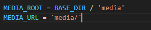
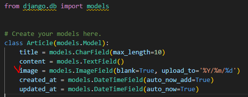
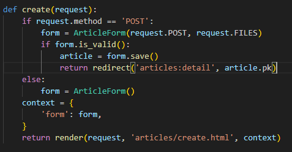

# Static
- 서버가 가지고 있는 리소스를 활용해 제공.
- 웹 서버는 요청받은 url로 서버에 존재하는 정적 자원을 제공함.

## django - static files 기본 경로
- app/static/
    - 이는 settings.py의 STATICFILES_DIRS로 수정 가능.
    ```python
    STATICFILES_DIRS = [
        BASE_DIR / 'static',
    ]
    # 이렇게 하면, BASE_DIR > static을 기본으로 함.
    ```
- 적용 방법
    ```django
    
    <!-- html파일 최상단에서 이 과정 필요 -->

    
    ```
- 이를 활용하면 django가 url을 생성해준다. (img 제공 가능, settings.py의 STATIC_URL 위 주소를 기반으로 생성함.)

# Media file
- 사용자가 웹에서 업로드하는 정적파일

## ImageField()
- 이미지 업로드에 사용하는 모델 필드
- DB에 '이미지 파일의 경로'가 문자열로 저장됨! (객체를 직접 저장하는 것 아님)

### 미디어 파일 제공을 위한 사전준비
1. settings.py에 MEDIA_ROOT, MEDIA_URL 설정
2. 작성한 MEDIA_ROOT, MEDIA_URL에 대한 url 지정

- **settings.py**



- **urls.py**


3. models.py 수정

- 이후 pip install Pillow (ImageField()사용 위함)
- models.py가 수정되었으니, DB또한 수정하는 과정 필
- makemigrations, migrate
- upload_to 는 media 파일 내(MEDIA_ROOT), 새로운 경로에 이미지를 저장하도록 하는 것.

4. html의 form 속성 추가
- 기존 form tag는 text형태의 데이터만 전달할 수 있음.
- 따라서 enctype = "multipart/form-data"를 추가해야함.
```django
<form action="" method="POST" enctype="multipart/form-data">
```

5. view함수 수정
- 업로드 하는 파일들은 POST 방식으로 전달되지 않는다. 따라서 request.FILES를 추가해야 한다.


### 업로드 한 이미지 출력 방법
- html파일에 {{ article.image.url }} 추가
- 또 , blank = True로 설정했으므로, 이미지가 없는 경우 에러를 방지하기 위해 if tag로 이를 처리
