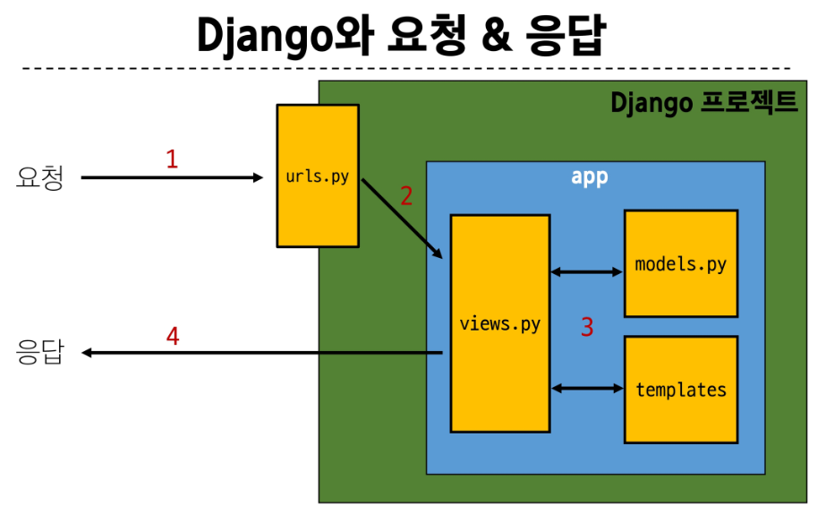
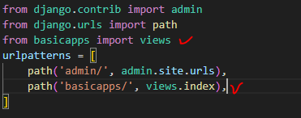
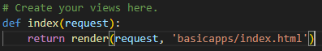
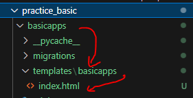

# 이해를 못해서 만드는 md
## Django 기초
### Django의 활용처?
- Backend : 웹개발에서 BE는 서버측에서 동작하며, 클라이언트의 요청에 대한 처리와 DB와 상호작용 담당
    - python, java, framework, DB, API ..
### 가상환경의 필요성
- 협업할 때, 버전을 맞춰야 하기에 활용한다. (패키지 의존성 문제)
- 작동 과정은 아래와 같다.
```python
# 가상환경 생성
python -m venv venv
# 이 때, 뒤에 있는 venv는 가상환경의 이름으로, 이 이름은 변경할 수 있지만 venv가 약속

# 가상환경 활성화
source venv/Scripts/activate
```
- 가상환경을 생성하고 실행한다면 패키지를 설치해야한다.
- 해당 프로젝트에 활용되는 패키지는 requirements.txt에 저장한다.
- 활용되는 패키지를 작성하는 방법, install하는 방법은 다음과 같다.
```python
# requirements.txt를 생성(존재한다면 최신화)하는 방법
pip freeze > requirements.txt

# install
pip install -r requirements.txt
```

## Django - 프로젝트 시작
```python
# 장고를 이용한 프로젝트 생성
django-admin startproject project_name .
# 뒤에 .을 붙혀야 프로젝트 파일이 활용하기 편하게 생성됨
'''
이후 프로젝트 파일을 수정하고 앱을 추가하고 ... 작업을 진행한 뒤
'''
# 프로젝트 실행
django manage.py runserver
```
### 프로젝트를 생성할 때 생기는 파일들의 목적
- `settings.py`
    - 프로젝트의 모든 설정을 관리한다.
    - 추후 앱을 생성하는 등의 과정을 진행할 때, settings에 이를 반영해야 한다.
- `urls.py`
    - 들어오는 요청 url에 따라 적절한 views와 연결하기 위해 사용한다.
- `__init__.py`
    - 해당 폴더를 패키지로 인식하도록 한다.
- `asgi.py`
    - 비동기식 웹 서버와의 연결 관련 설정
- `wsgi.py`
    - 웹 서버 연결 관련 설정
- `manage.py`
    - 프로젝트와 다양한 상호작용을 진행하는 파일!
## Django - 앱 생성
```python
# 앱 생성
python manage.py startapp app_name
# 앱을 생성한 이후엔, setting.py 내 INTALLED_APPS에 앱을 등록해야 한다.
```
### 앱을 생성할 때 생기는 파일들의 목적
- `admin.py`
    - 관리자용 페이지를 설정하기 위함
- `models.py`
    - DB 관련된 Model을 정의하기 위함
- `views.py`
    - HTTP 요청을 처리하고, 해당 요청에 대한 응답을 반환하기 위함
    - urls, model, template와 연결되어있다.

## 프로젝트 생성 과정
1. 가상환경을 생성하고 실행한다.
2. 필요한 패키지를 설치한다 (requirements.txt)
3. django-admin startproject project_name .
    이 때 python manage.py runserver 하고 웹 들어가면 로켓 표시

## 이후 앱을 생성하는 과정
1. python manage.py startapp basicapps(appnames, 복수형 권장)
2. project 파일 내 settings.py에서 추가한 앱 등록

## Django 요청 & 응답

- 위 그림 흐름에 따라 다음의 과정을 거쳐야 한다.
### 1. urls.py 수정
- app 내의 views.py로 요청을 보내야하므로 path를 지정해야한다.
    - from app_names import views
    - urlpattenrs 내 path('index/', views.index),

### 2. views.py 수정
- urls.py 에서 온 요청을 수행하기 위해 함수를 정의한다.
- 이 때 render을 활용한다

```python
def index(request):
    return render(request,'articles/index.html')
```
### 3. templates 생성
- index.html을 가지고 있는 templates를 생성해야 위의 파일들이 정상 작동한다.
- views.py 내 정의된 함수의 render 내 좌표는 app/templates/까지는 기본경로로인식

